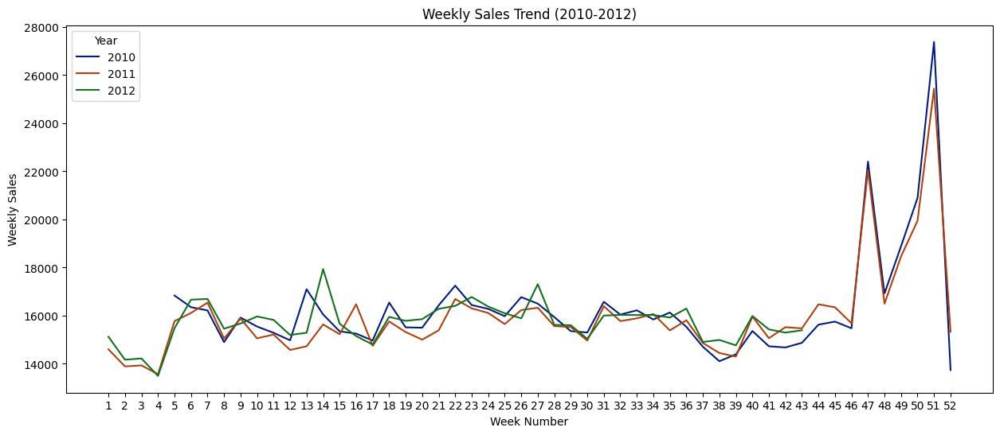
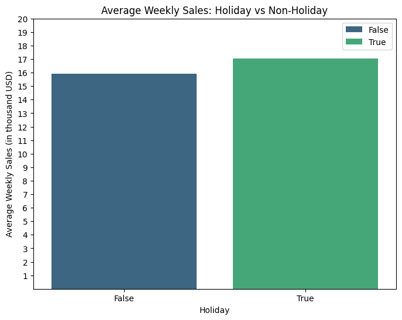
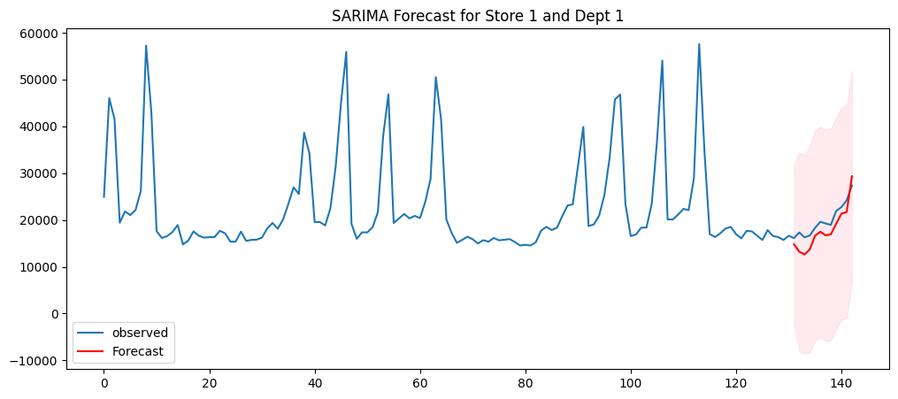
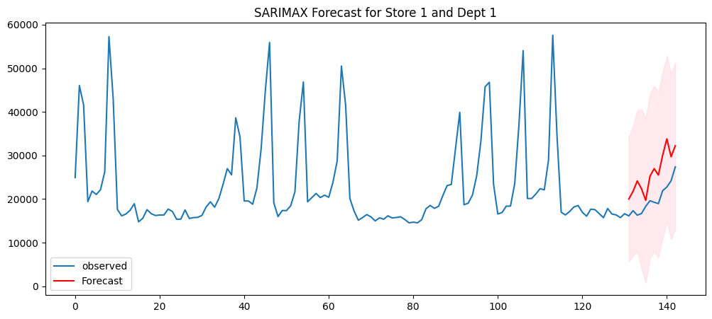

# Walmart-Sales-Data-Analysis-and-Forecasting

## Overview
Analysing and understanding the sales trends are crucial for decision making and estimating future sales. Objective of this project is to analyse Walmart Sales data and forecast future sales using Machine Learning and Statistical methods.

## Dataset
[Walmart Sales Dataset](https://www.kaggle.com/datasets/aslanahmedov/walmart-sales-forecast/data)

## Methodology

### Data Preprocessing
To prepare the data for analysis, we first combined multiple datasets (**train, features, and stores**) into a single, structured dataset. Since some columns, like the **Markdown features**, had too many missing values, thwy were removed to keep the data clean. Converted the **Date** column into a proper datetime format and extracted useful time-based features like **Year, Month, and Week**. Categorical variables, such as **Store Type** and **IsHoliday**, were encoded for better processing, and numerical features were standardized to improve model accuracy.

### EDA
Conducted an exploratory data analysis (EDA) to uncover key sales patterns, seasonal trends, and external factors influencing Walmart’s sales. Weekly sales data revealed clear seasonality, with noticeable spikes during major holidays like Thanksgiving and Christmas. Store-wise analysis highlighted variations in sales performance, while correlation analysis helped identify the impact of external factors like fuel prices and CPI. Also detected and examined outliers to distinguish genuine seasonal peaks from anomalies. 

  

### Forecasting
#### (A) Statistical Methods
Used Sarima and SARIMAX on a store and dept pair to forecast next 12 week's sales. SARIMA captures seasonality and trends in time-series data. SARIMAX, an extension of SARIMA that incorporates external regressors such as CPI, fuel prices, unemployment and holidays. This improved the model's ability to adjust for external influences, leading to more precise forecasts.

#### (B) Machine Learning Models
Tree based regressors like Random Forest(with 100, 250 and 500 estimators and max depth=15) and XGBoost(with 100, 250 and 500 estimators and max depth=15) were trained to capture complex interactions between features. XGboost is known for its efficiency and ability to handle large datasets. Linear Regression was also fit on the data.
- MSE for Random Forest with 100 estimators : 4215.56
- MSE for Random Forest with 250 estimators : 4218.83
- MSE for Random Forest with 500 estimators : 4216.90
- MSE for XGBooost with 100 estimators : 3036.54
- MSE for XGBooost with 250 estimators : 2959.85
- MSE for XGBooost with 500 estimators : 2940.05
- MSE for Linear Algebra : 21464.89

## Conclusion
- XGBoost with 500 estimators and max depth 500 performed best among all the trained forecasting models.

